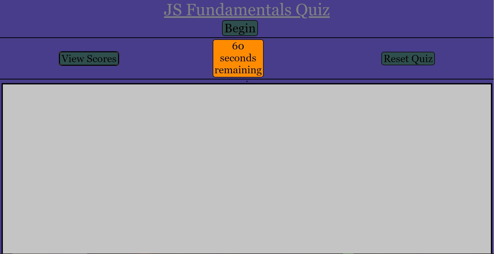

# Javascript-Quiz-Time
## About
This is a JavaScript quiz. This is a timed quiz with 5 basic questions. (It currently does not work to expectation.)
## Preview

## How to Play
Click this link to go to the quiz. https://jaystepz.github.io/Javascript-Quiz-Time/

When at the page, click the Begin button to start the quiz.

You will have 60 seconds to answer the 5 questions, with each wrong answer deducting time from the counter.

When you are finished, it will prompt you for your initials and save your score. (Functionality after that is busted and I can't figure it out right now.)

The Reset Quiz button will reset the quiz so you can try again.

The View Scores button will bring up the previous scores. (Will not work because I can't figure out how to save the initials and scores.)
## Credit
A classmate, Jacob, helped me out some. Just couldn't get enough help to finish this project.